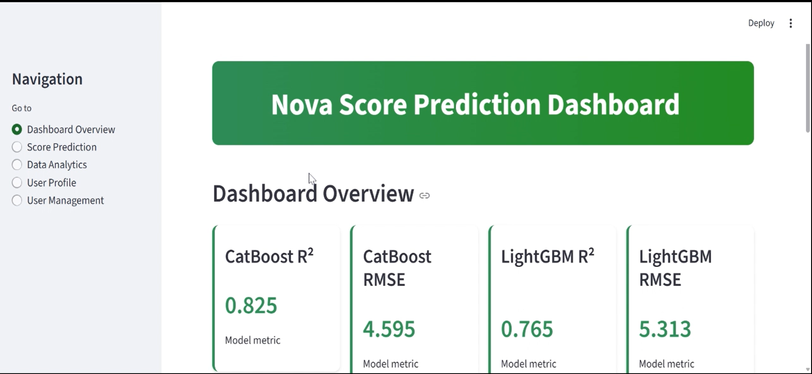
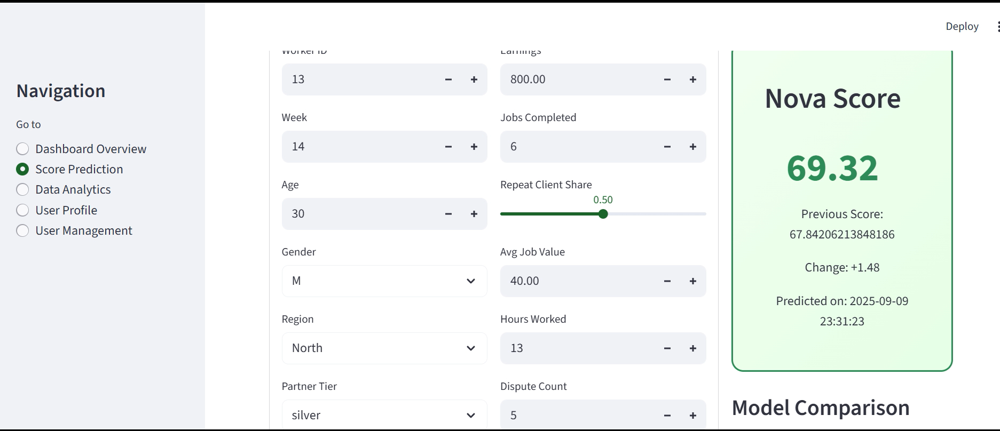
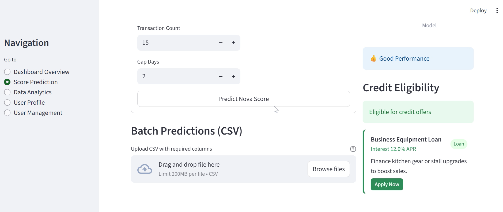
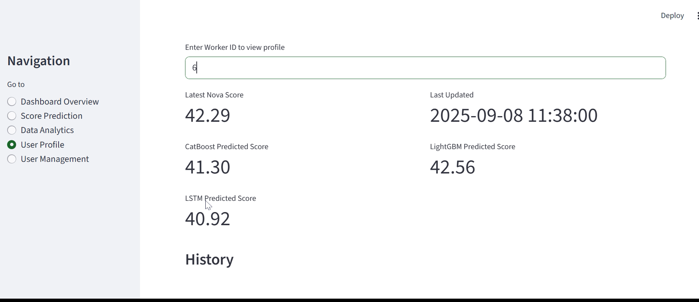
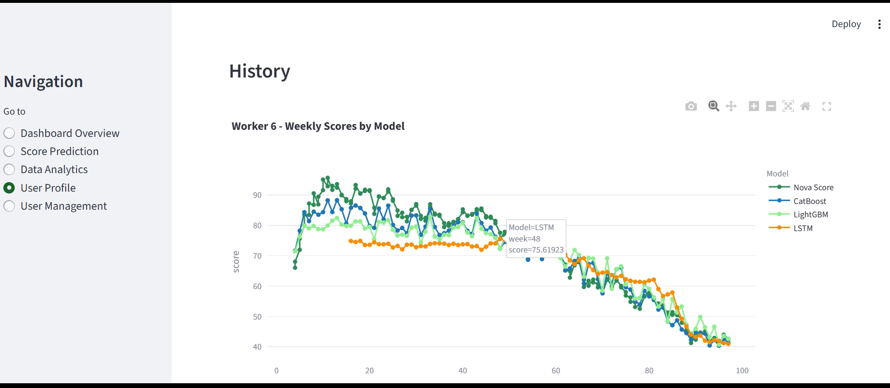
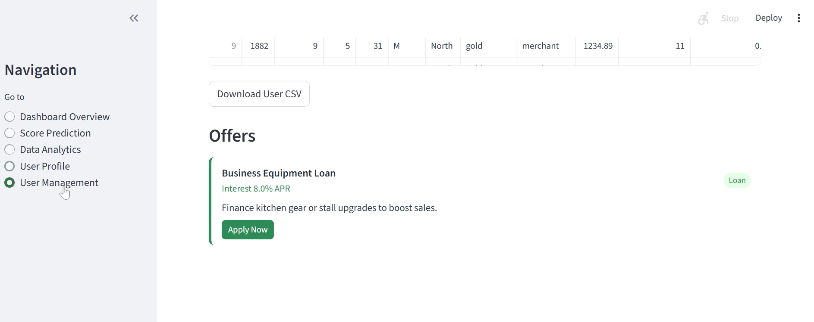

# Nova Score Prediction Dashboard  
### *Streamlit + CatBoost + LightGBM + LSTM*

The **Nova Score Dashboard** is a unified analytical platform that predicts a worker’s *creditworthiness* or *performance score* (Nova Score) using multiple machine learning models.

---

## Overview

This project is designed to:
- Predict and visualize **Nova Scores** for different types of workers (drivers, merchants, others).  
- Integrate **multiple ML models** — CatBoost, LightGBM, and TensorFlow LSTM — for comparative analysis.  
- Support both **single predictions** (through a form) and **batch predictions** (via CSV upload).  
- Store user data, predictions, and scores persistently in a **SQLite database**.  
- Provide **interactive analytics dashboards** (feature importance, correlation, demographic insights).  
- Suggest **credit eligibility and offers** dynamically based on predicted scores.  

---

## Components

| Module | Description |
|--------|--------------|
| **app.py** | Main Streamlit entry point — manages routing and page rendering. |
| **lib/config.py** | Central configuration file for paths, constants, and feature definitions. |
| **lib/db.py** | Handles SQLite database initialization, insertion, and querying. |
| **lib/models.py** | Loads CatBoost, LightGBM, and LSTM model. |
| **lib/normalization.py** | Normalizes input data using precomputed group statistics (per gender/region). |
| **pages/** | Contains individual Streamlit pages (Dashboard, Analytics, Prediction, Profile, Management). |
| **data/** | Stores model artifacts, normalization stats, and combined prediction CSV. |
| **notebooks/** | Jupyter notebooks used for model training, feature analysis, and experimentation. |

---

## 📸 Screenshots

|  |  | | | | 


## Installation and Setup

### 1️ Clone the repository
```bash
git clone https://github.com/simaranmaurya007/nova-score-dashboard.git
cd nova-score-dashboard
```
### 2️ Create and activate a virtual environment
```bash
python -m venv venv
source venv/bin/activate      # macOS/Linux
venv\Scripts\activate         # Windows

```
### 3️ Install dependencies
```bash
pip install -r requirements.txt
```

If TensorFlow installation fails on your system, you can comment it out from requirements.txt.
The app will still function perfectly using CatBoost + LightGBM.

### 4 Run the Dashboard
```bash
streamlit run app.py
```
